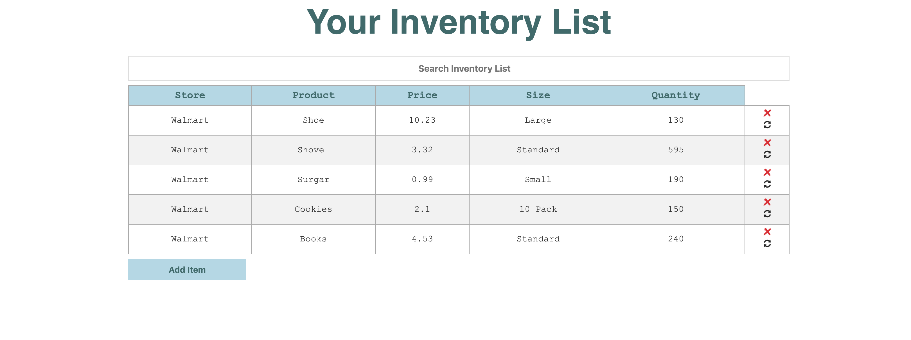
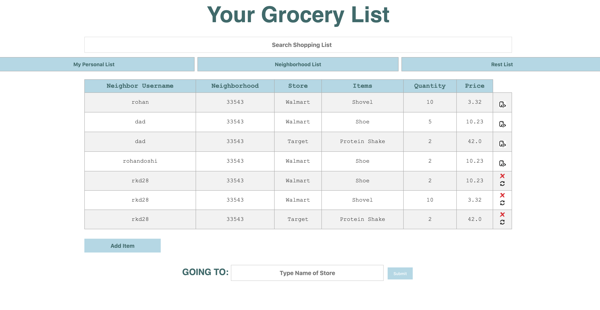
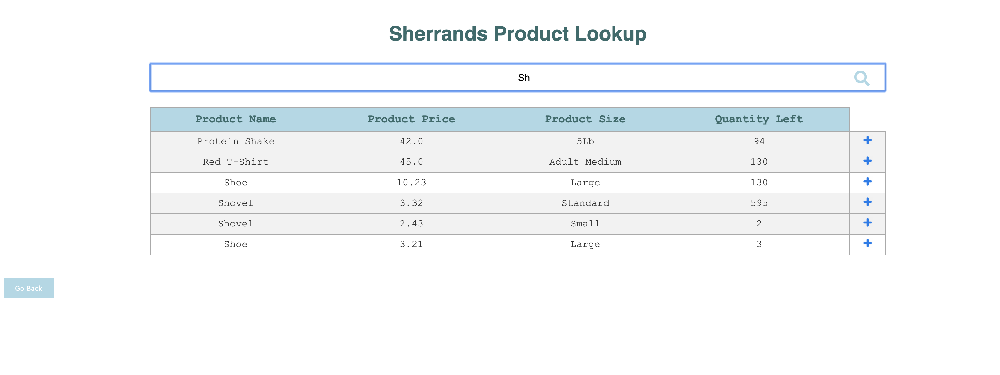

# Sherrands
Sherrands is a community-based grocery-delivery app to make delivery faster and more affordable. We realized that a consequence of COVID-19 is that small businesses lose much of their revenue as consumers flock towards large corporation's e-commerce platform when shopping. We wanted to give a platform to small businesses to sell their products online while also building a logistics pipeline to ensure speedy and affordable delivery.

We are challenging basic economic delivery models by allowing users to be both a consumer and deliverer on the platform. The idea is that if you, the ever-day person, are making a trip to your local grocery store, you would be willing to pick up a few extra grocery bags to delivery to a neighbor on your way home for some extra side-revenue as it doesn't substantially add to your commute.  

## Homescreen


## Product Inventory Input Page


## Consumer Grocery List Page


## Inventory Search Page


Run server locally:
```
FLASK_APP=main.py flask run
```
